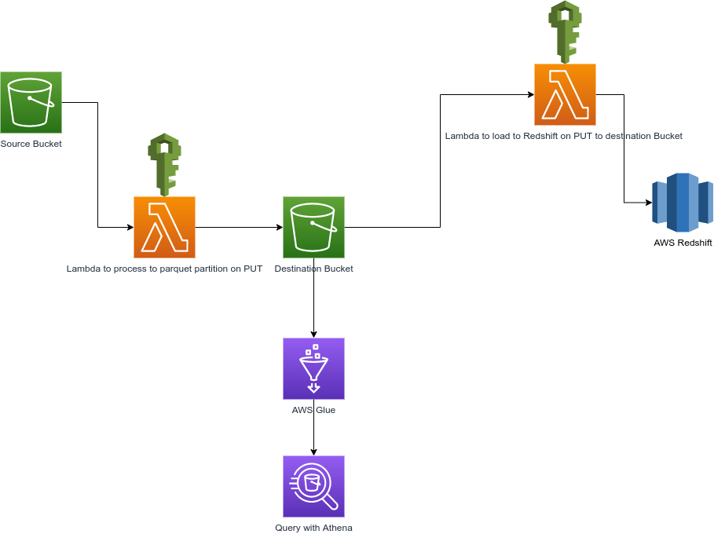

# serverless-etl-workflow
A Project on Serveless workflow with AWS Glue, S3 &amp; Lambda

## Architecture

## Steps for deploying with AWS SAM
1. Create events/events.json and write test events into it.
2. Run `sam build` if functions and events in another folder or subfolder run `sam build -s relative_folder_path`.
3. Run `sam deploy` with your custom arguments.

**Optional: You can checkout `services.yml` to create 2 buckets(source & destinaton) but would probably have to change the bucket names where specified**

#### Note: Manually add Trigger after bucket creation, because AWS SAM doesn't allow referencing existing buckets outside the template(i.e resource not created in the template).
#### Note: Copy contents in events/events.json and use as test event, p.s would not work if object key doesn't exist in bucket so change to something that exists in yours.